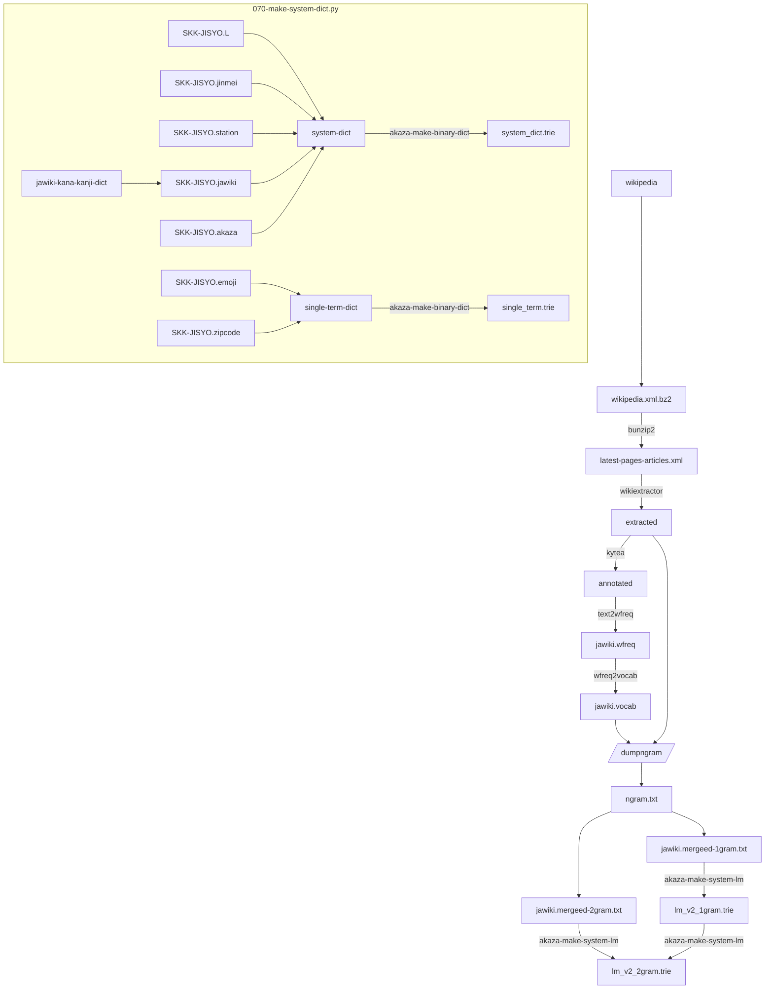

# akaza の data flow

```mermaid
graph
    wikipedia --> wikipedia.xml.bz2
    -- bunzip2 -->latest-pages-articles.xml
    -- wikiextractor --> extracted
    -- kytea --> annotated
    -- text2wfreq --> jawiki.wfreq
    -- wfreq2vocab --> jawiki.vocab
    jawiki.vocab --> dumpngram[/dumpngram/]
    extracted --> dumpngram[/dumpngram/]
    --> ngram.txt
    ngram.txt --> jawiki.mergeed-1gram.txt
    ngram.txt --> jawiki.mergeed-2gram.txt

    jawiki.mergeed-1gram.txt -- akaza-make-system-lm --> lm_v2_1gram.trie
    jawiki.mergeed-2gram.txt -- akaza-make-system-lm --> lm_v2_2gram.trie
    lm_v2_1gram.trie -- akaza-make-system-lm --> lm_v2_2gram.trie

    subgraph 070-make-system-dict.py
        SKK-JISYO.L --> system-dict
        SKK-JISYO.jinmei --> system-dict
        SKK-JISYO.station --> system-dict
        jawiki-kana-kanji-dict --> SKK-JISYO.jawiki --> system-dict
        SKK-JISYO.akaza --> system-dict
        system-dict -- akaza-make-binary-dict--> system_dict.trie

        SKK-JISYO.emoji --> single-term-dict
        SKK-JISYO.zipcode --> single-term-dict
        single-term-dict -- akaza-make-binary-dict--> single_term.trie
    end
```
