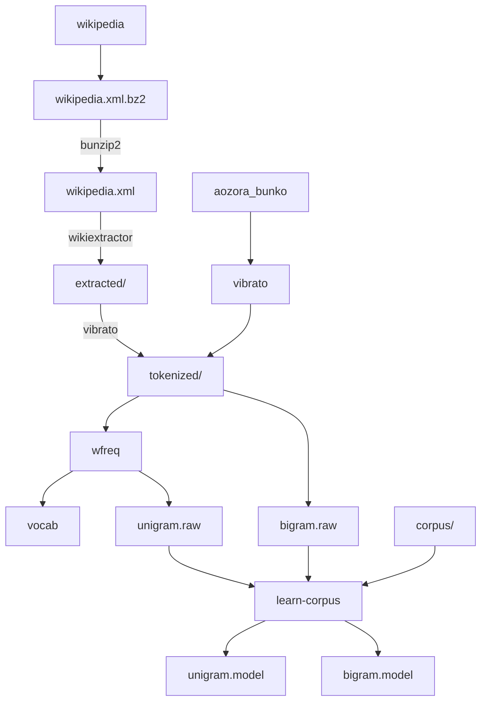
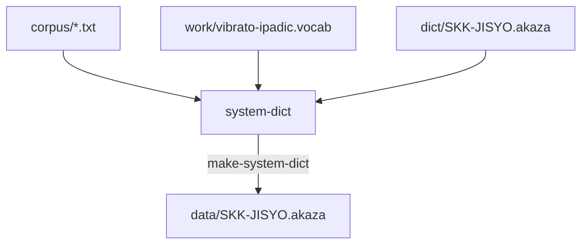

# akaza の data flow

## language model の作成フロー

ここで、language model とは日本語における単語の発現確率のことを指す。

akaza では、基本的に wikipedia 日本語版および青空文庫のデータをもとに単語の発現確率及び 2gram での発現確率を求めている。

わかちがき処理及びよみがな処理には vibrato+ipadic を利用している。

## システム辞書

ひらがなと漢字の変換表として、システム辞書を用意している。
主に SKK の辞書と、wikipedia から生成された SKK 用の辞書である jawiki-kana-kanji-dict をベースにしている。

ここで生成される辞書形式は、BinaryDict と呼ばれている。

## ユーザー言語モデル

akaza はユーザーごとに学習が可能なように設計されている。
シンプルに実装するために、ユーザー言語モデルはプレインテキスト形式で保存される。
プレインテキスト形式なので、ユーザーは自分の好きなようにファイルを変更することが可能である。

